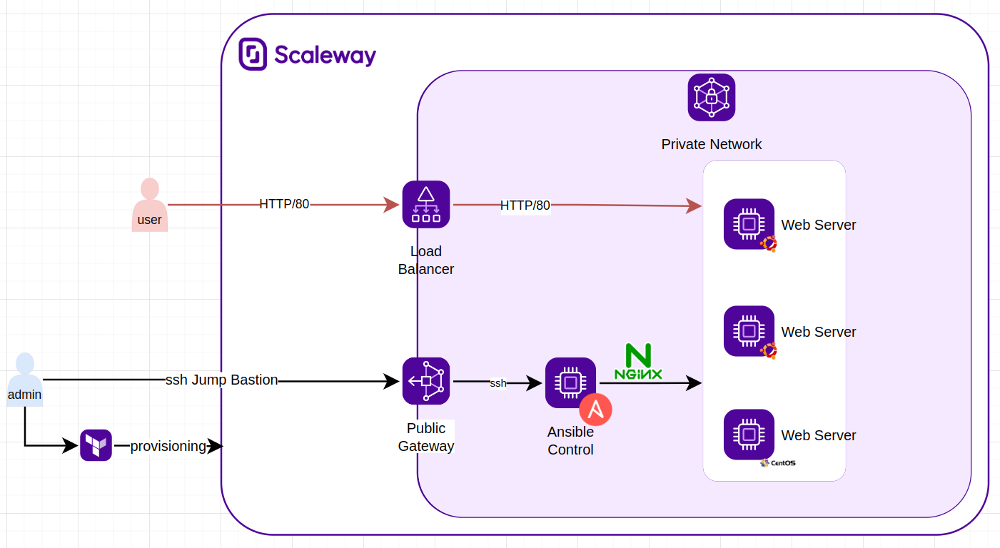
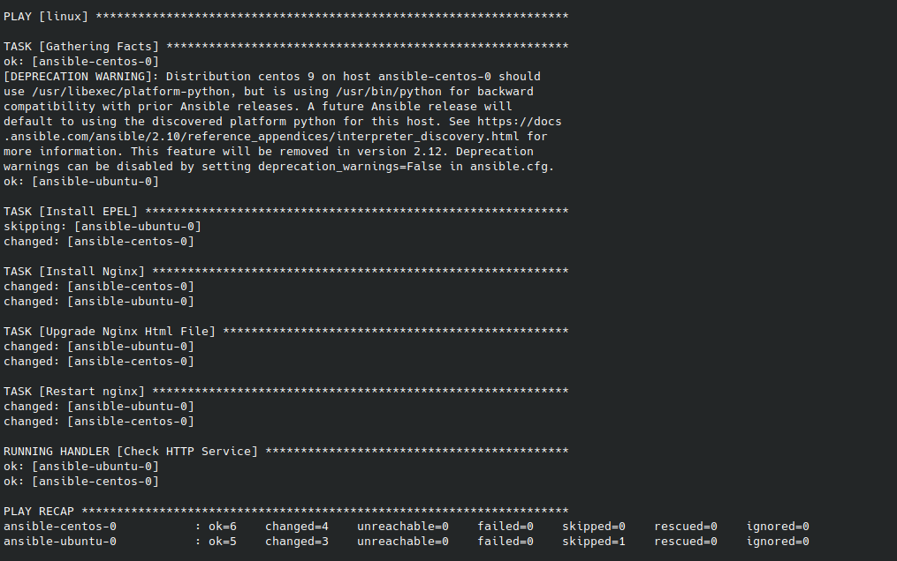

# Overview

Project that combines Ansible and Terraform to deliver infrastructure within Scaleway VPC Context.



The architecture can be subdivided in two parts : 
- Provisioning/Configuration Mananagement
- Service Access

## Provisioning
Terraform will be used from an admin local computer to deploy the whole architecture that contains the following :
- VPC (Private Network & Public Gateway)
- 
- Ubuntu Controller(i.e : Ansible Pre Installed through Cloud Init)
- Ubuntu & Centos Web Server Hosts
- SSH Keys Generation (i.e. those keys are added as project keys so that they can be use to access any server and are also put as ssh key on the controller so that he can access to every server)
- Ansible Configuration Generation in Ansible Controller
    - Static Inventory
    - Default Configuration
The inventory will be on the following form :
//TODO Image of the inventory

Hosts are gathered under the linux category which have 2 sub category centos and ubuntu that allow us to customize our ansible configuration depending on the nature of the host.
- Nginx Playbook sources Copy in the controller
## Configuration Management
Ansible will be in charge of deploying Nginx web server on the targeted web server. Ansible will be deployed on the controller.
It will be accessible using the Public Gateway bastion. 

```ssh -J bastion@$bastion_ip:61000 $user@ansible-controller.ansible-pn```

## Service Access
The Nginx Service will be accessible through the Load Balancer that has been configured to automatically Round Robin between the web servers.

# Deployment
## Prerequisites
- Terraform
- [Scaleway API Keys](https://www.scaleway.com/en/docs/console/my-project/how-to/generate-api-key/): For security reasons, the secret key retrieved must be put as environment variable **TF_VAR_scw_secret_key**, otherwise it can be written directly within terraform files.

## Infrastructure
1. Open infrastructure folder with a cmd
2. Copy terraform.tfvars.template -> terraform.tfvars (Fill it with your properties controller node type , zone , ...)
3. Copy provider.tf.template -> provider.tf (Fill it with your Scaleway Data region, zone ..)
2. terraform init
3. terraform plan (i.e. if you wan to check components that will be deployed)
4. terraform apply -auto-approve


## Application Deployment
The infrastructure deployment step has also added the ansible-playbooks source in this project within the Ansible Controller Server. So that it can be executed once the infrastructure has been delivered. The command to be used has been defined as  output of the terraform script "ansible_playbook_deploy".
```ansible_playbook_deploy = "ssh -J bastion@bastion_ip:61000 root@ansible-controller.ansible-pn ansible-playbook  /root/ansible-playbooks/nginx_playbook.yaml"```

This output value should be copied and executed within a command for nginx deployment to happen.



The Nginx Application deployed will be accessible from the Load Balancer Public IP. It can be retrieved from the terrafomr output **service_address**

Application has been provisionned so command can be launched
1. kubectl apply -f k8s
Terraform will be used to deploy the whol

//TODO IP of the Load Balancer with terraform

Project that combines ansible and terraform to deliver infrastructure and configuration on scaleway infrastructure. VPC Context
# Infrastructure
Terraform will be used to provide underlying infrastructure which will perform the following :
- Ubuntu Controller  with ansible installed (through Cloud init)
- Scaleway Credentials update within 
- 2*Ubuntu Server 
- 1* Centos Server
- SSH Key Generation
- Ansible Configuration Generation (including static hosts group)
    following model
    [ubuntu]
ansible-ubuntu-0
ansible-u
[centos]
[linux:children]
centos
ubuntu
tf_var_secret_key
# Ansible
Ansible will be here used for applications deployment on our instance
keys
# Deployment
# TODO Add schema
## Prerequisites
- Terraform
## Infrastructure
1. Rename terraform.tfvars.template -> terraform.tfvars
2. Rename provider.tf.template -> provider.tf
3. Provide provider info
4. Fill the terraform.tfvars
5. terraform init 
6. terraform apply
# Disclaimer 
Static Hosts
root user
Playbook source is copy once